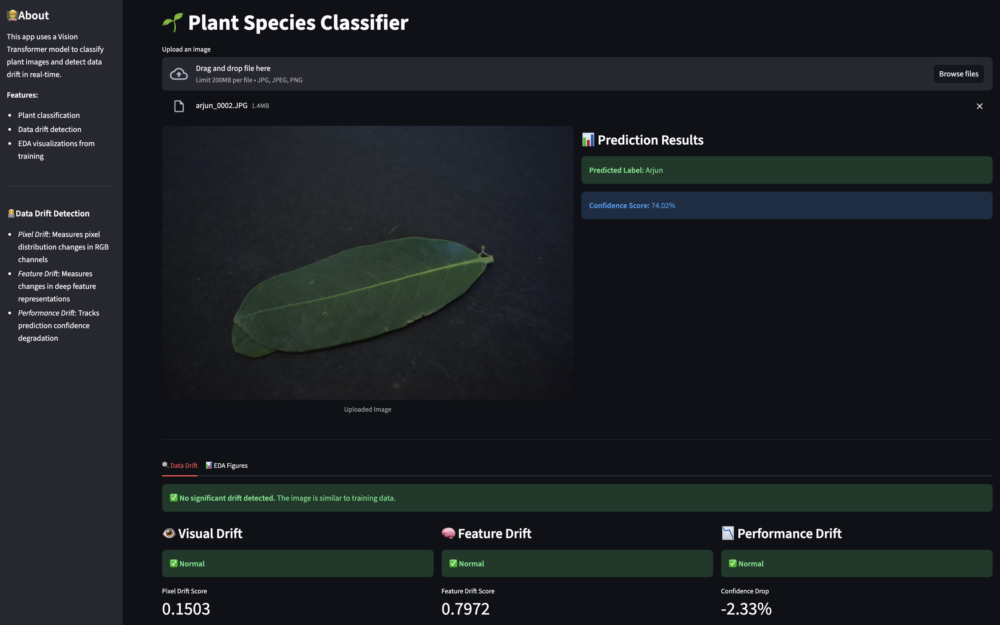

# Plant Species Classifier

Computer-vision workflow that identifies Indian plant species from a single leaf photo, tracks every experiment with MLflow, and surfaces drift signals so the model stays reliable after deployment.



## Why it matters
- Gives botanists and farmers instant feedback instead of waiting for manual identification.
- Wire up reproducible training, MLflow governance, and post-training monitoring end-to-end.
- Impact: (classification + real-time drift) and engineering rigor (pipelines, logging, metrics).

## System at a glance
- **Data + Model:** Fine-tunes `google/vit-base-patch16-224-in21k` on the 592-image [Indian Plant Leaves Species](https://huggingface.co/datasets/avaishnav/Indian-plant-leaves-species) dataset (12 label classes, Apache-2.0).
- **Experiment tracking:** MLflow (`sqlite:///mlflow.db`) stores parameters, metrics, model artifacts, torch checkpoints, and all EDA charts (class balance, pixel stats, sample predictions).
- **Post-training monitoring:** Drift detector compares pixel, deep-feature, and confidence distributions against saved reference stats; Streamlit visualizes the health of each dimension.
- **User experience:** Streamlit app delivers predictions, confidence, and drift flags in one view for technical and non-technical stakeholders.

## Setup
```bash
pip install uv
uv venv
source .venv/bin/activate
uv sync
```

## Pipelines & Commands
### Training pipeline (fine-tuning + EDA logging)
```bash
uv run main.py --mode train
```
This pulls data from Hugging Face, performs preprocessing, runs the ViT Trainer, evaluates on held-out data, logs metrics/figures/models to MLflow, and saves dataset splits for monitoring.

### Inference pipeline (batch/script usage)
```bash
uv run python - <<'PY'
from pathlib import Path
from PIL import Image
from plant_classifier.pipelines import inference_pipeline

image = Image.open(Path("path/to_leaf.jpg"))
result = inference_pipeline(image, include_drift=False)
print(result)
PY
```
Returns the ranked label list with scores; enable `include_drift=True` when drift stats exist (see next step).

### Drift reference computation (post-training baseline)
```bash
uv run scripts/compute_drift_reference.py
```
Builds pixel, embedding, and confidence distributions from the validation split and stores them under `plant_classifier/artifacts/drift_reference/reference_stats.pkl`.

### Streamlit monitoring + inference UI
```bash
streamlit run app.py
```
Uploads images, performs inference, and shows visual/feature/performance drift panels plus EDA figures—ideal for demos or lightweight production monitoring.

### MLflow UI (experiments, EDA, post-training metrics)
```bash
mlflow ui --backend-store-uri sqlite:///mlflow.db --port 5000
```
Compare runs, inspect logged EDA images, download models, and register promotion-ready versions in the model referenced by `mlflow_registered_model_name`.

### Databricks / Unity Catalog tips
- Set `MLFLOW_TRACKING_URI`/`MLFLOW_USER`/`DATABRICKS_TOKEN`/`DATABRICKS_HOST` in your environment to enable remote tracking.
- Update `plant_classifier/configs/train.yaml` → `mlflow_registered_model_name` to the fully-qualified `catalog.schema.model` expected by Unity Catalog (keep the simple name for the legacy workspace registry).
- Optional: set `MLFLOW_REGISTRY_URI` to `databricks-uc` (Unity Catalog) or `databricks` (legacy) before running the training or drift scripts.

## License
Project code and dataset follow Apache-2.0; see repository files and the dataset card for details.
